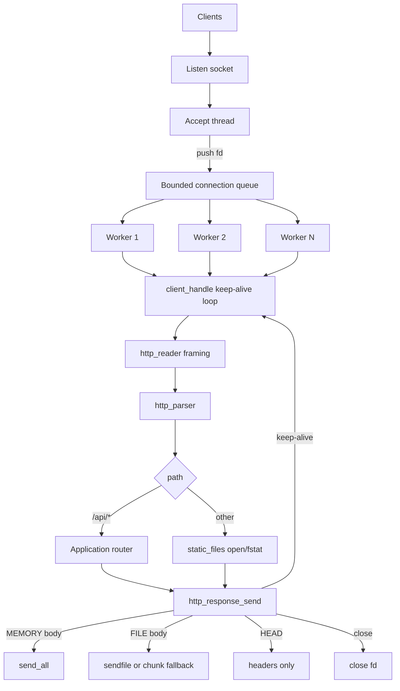

# CinderHTTP

CinderHTTP is an HTTP/1.1 server written from scratch in C using POSIX sockets
and pthreads. It is a learning-focused systems project: bounded concurrency,
manual protocol framing, secure static serving, and measurable performance —
without an HTTP framework or parsing library.

**Status: Stage 10 complete — implementation roadmap complete.** See
[`docs/roadmap.md`](docs/roadmap.md) for the staged build-out and optional
future extensions.

## Why

Most “hello world” servers hide the hard parts behind libraries. CinderHTTP
exposes them deliberately:

- Accept never does HTTP work — a bounded queue and fixed worker pool apply
  backpressure under load
- Requests are framed across multiple `recv()` calls with leftover-byte
  preservation for keep-alive
- Static files stream from an open `fd` (Linux `sendfile`, portable bounded
  fallback) so heap use stays independent of file size
- Idle keep-alive and in-flight request deadlines are separate, tunable timeouts

## Features

- CLI configuration (`--port`, `--workers`, `--queue-size`, `--root`,
  `--keep-alive-timeout`, `--request-timeout`, `--verbose`, `--help`)
- TCP listen with `SO_REUSEADDR` and signal-driven graceful shutdown
- Bounded connection queue + fixed pthread worker pool
- Thread-safe logging and runtime statistics (`/api/stats`)
- Stateful multi-`recv()` HTTP framing with leftover-byte preservation
- HTTP/1.0–1.1 persistent connections (version-aware `Connection` policy)
- Application router: `GET /api/health`, `POST /api/echo`, `GET /api/stats`
- Secure static `GET`/`HEAD` with MIME detection and path confinement
- File-backed static responses: open → `fstat` → headers → Linux `sendfile`
  or O(1) chunked read/send fallback
- Separate idle keep-alive timeout vs total request framing deadline (408)
- Hardened unit/integration suite (ASan/UBSan, fuzz-style parser, raw clients)
- Reproducible API and static-file benchmarking harness

## Architecture



Full detail: [`docs/architecture.md`](docs/architecture.md).

## Quick start

Requires GCC (or another C11 compiler), GNU Make, and a POSIX environment
(Linux or macOS; on Windows, use WSL).

```bash
make
./bin/cinderhttp --port 8080 --workers 4 --queue-size 64 \
  --root ./public --keep-alive-timeout 5 --request-timeout 10 --verbose
```

```bash
curl http://localhost:8080/api/health
curl -X POST -H "Content-Type: text/plain" --data-binary "hello" \
  http://localhost:8080/api/echo
curl http://localhost:8080/
```

Stop with `Ctrl+C`.

## Configuration

| Option                     | Default    | Description |
|----------------------------|------------|-------------|
| `--port <n>`               | `8080`     | TCP port |
| `--workers <n>`            | `4`        | Worker thread pool size |
| `--queue-size <n>`         | `64`       | Bounded connection queue capacity |
| `--root <path>`            | `./public` | Static document root |
| `--keep-alive-timeout <s>` | `5`        | Idle wait for next request to begin (1–300) |
| `--request-timeout <s>`    | `10`       | Max wall-clock time to finish framing one request (1–300) |
| `--verbose`                | off        | Verbose logging |
| `--help`                   | —          | Usage |

## API Endpoints

| Method | Path | Notes |
|--------|------|-------|
| `GET`/`HEAD` | `/api/health` | `{"status":"ok"}` |
| `POST` | `/api/echo` | Binary-safe body echo |
| `GET`/`HEAD` | `/api/stats` | Runtime counters JSON |

## Concurrency model

Classic bounded producer–consumer: the accept thread pushes client fds; workers
pop and own the connection for its entire keep-alive lifetime. The queue stores
**connections**, not per-request work. A persistent client pins its worker until
close, idle timeout, request deadline, or max requests per connection.

See [`docs/architecture.md`](docs/architecture.md) and
[`docs/http_support.md`](docs/http_support.md).

## Project structure

```text
CinderHTTP/
|-- include/      Public headers (config, queue, pool, http_*, static_files, …)
|-- src/          Matching .c sources + main.c
|-- public/       Demo static site
|-- tests/        Unit tests + integration/ (curl, raw_http, keep-alive, static stream)
|-- benchmarks/   Load harness, fixture generator, parser unit tests
|-- docs/         Roadmap, architecture, HTTP support, memory model, testing
`-- Makefile
```

## Building

```bash
make            # optimized build -> bin/cinderhttp
make debug      # ASan/UBSan debug build
make debug test # sanitizer build + unit tests in one make run
make profile    # -O2 -g binary for external profilers
make sanitize   # ASan/UBSan unit tests
make valgrind   # unit tests under Valgrind (skipped if not installed)
make clean
```

Flags: `-std=c11 -Wall -Wextra -Wpedantic -Werror`.

## Testing

```bash
make test          # unit tests (incl. modest parser fuzz + bench parsers)
make integration   # live server checks through Stage 10
make sanitize      # ASan/UBSan unit tests
make fuzz          # deeper deterministic parser fuzz
make valgrind      # optional Valgrind sweep
make coverage      # optional gcov summary
make profile       # profiling build target
```

Details: [`docs/testing.md`](docs/testing.md).

## Benchmarking

```bash
make benchmark              # default API workload (GET /api/health)
make benchmark-api          # explicit API shortcut
make benchmark-static       # generate fixtures + 1 MiB static workload
make benchmark BENCH_ARGS="--connections 128 --duration 15"
```

Requires `wrk`, `hey`, or `ab` on `PATH`. Static fixtures are generated under
`benchmarks/fixtures/` (gitignored) via `generate_fixtures.py` /
`--generate-fixtures`. Results are machine- and environment-dependent — do not
treat them as production capacity claims. See
[`benchmarks/README.md`](benchmarks/README.md).

## Design decisions

| Choice | Rationale |
|--------|-----------|
| Fixed worker pool + bounded queue | Predictable concurrency; accept backpressure when saturated |
| Queue stores connections | Matches blocking I/O; keep-alive stays on the same worker |
| File-backed static bodies | Heap stays O(1) w.r.t. file size; `sendfile` on Linux |
| Separate keep-alive vs request timeouts | Idle silence ≠ Slowloris-style trickle |
| Content-Length only | Framing stays simple; chunked encoding left optional |
| Manual parser | Educational clarity and explicit limit enforcement |

## Implementation highlights

- **`http_reader_t`** — connection-scoped accumulator; extracts one framed
  message; preserves leftovers with `memmove` compaction
- **`http_response_t` body kinds** — `NONE` / `MEMORY` / `FILE`; destroy closes
  a file-backed `fd`
- **Static path** — URL decode → lexical normalize → `realpath` confinement →
  `open`/`fstat` → `set_file_body` → stream
- **HEAD** — same `Content-Length` as GET; sender skips body bytes
- **Timeouts** — idle keep-alive uses empty-buffer wait; once bytes arrive,
  `CLOCK_MONOTONIC` request deadline applies (408 on expiry)

## Limitations (intentional scope)

- No chunked transfer encoding, TLS/HTTPS, or HTTP/2+
- No concurrent pipelining (buffered requests are handled sequentially)
- No Range / ETag / compression / directory listings
- Persistent connections pin a worker until release (no event-driven I/O)
- Static files capped at 64 MiB (`HTTP_MAX_STATIC_FILE_SIZE`) as a worker
  monopolization bound, not a heap-size guard
- No dynamic thread-pool resizing; query strings are not parsed into maps

Optional extensions (not a committed next stage) are listed in
[`docs/roadmap.md`](docs/roadmap.md).

## Memory safety

`make debug test` runs under AddressSanitizer and UndefinedBehaviorSanitizer.
Ownership rules: [`docs/memory_model.md`](docs/memory_model.md).

## License

[MIT](LICENSE)
